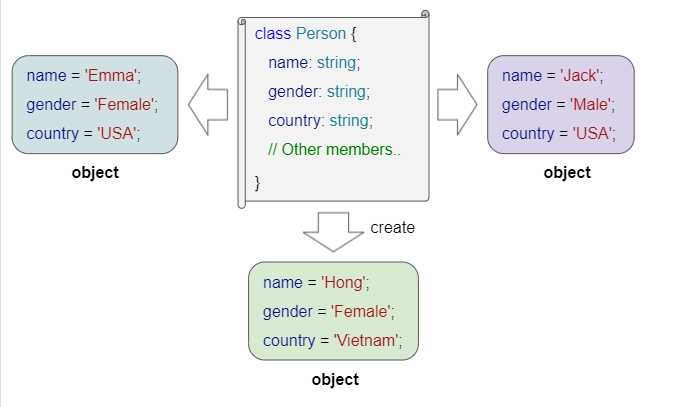

# Briefing

You will have to find the following information and test them as you go along in your program to experiment and understand how TypeScript will help you write your best code!

## Level 1

- Which are the different primitive data types in TypeScript? 

We find seven primitives data types in TypeScript : string, number, boolean, null, undefined, symbol, bigint. The most commonly used are : string, number, boolean.
We define variables by using them without Uppercase.

- How to type an Array?

It depends of what you are going to put in your Array.
```let fruit : string[] = ["apple", "Orange", "Banana"];```

We can declare an array with data type union - number and string:
```let tab : (string | number)[] = ['Apple', 'Orange', 1, 2, 'Banana', 3];```

An oser way to declare an Array : 
```let fruits: Array<string> = ["Apple", "Orange", "Banana"];```

- What is the `any` type?

When we declare a variable without type, TypeScript considers the "any" type.

- How to type the return of a function as well as the type of its parameters?

To define the return type of a function, we need to write the type after the parameters.

```ts
function myFunction(): number {
  return 26;
}
```

**🎉🎉🎉Update the Github Project board🎉🎉🎉**

## Level 2

- What is a class?

It's a group of object (created by NEW word) wich have all the same properties. A class is acting like a template, to build a lot of parameters in one shot, for another lot of element.

```ts
class Point {
  x: number;
  y: number;
}

const pt = new Point();
pt.x = 0;
pt.y = 0;
```

- What is a class constructor?

The constructor is a special method of the class, used to create objects and initialize field values.


Example :
```ts
class Point {
  x: number;
  y: number;
 
  // Normal signature with defaults
  constructor(x = 0, y = 0) {
    this.x = x;
    this.y = y;
  }
}
```

- What is a class instance?

When we create a class instance, we create a specific object with values beetwin parenthesis.
Exemple:
```const premierPoint = new Point (12, 45);```

- How to check that a class is of a certain instance?

The instanceOf operator in TS is used to check whether an object is in instance of a particular class or not.
objectName instanceOf className; here, if objectName is an instance of className, the operator returns true.
Othewise, it return false.

Example:
```ts
function Car(make, model, year) {
  this.make = make;
  this.model = model;
  this.year = year;
}
const auto = new Car('Honda', 'Accord', 1998);

console.log(auto instanceof Car);
// Expected output: true

console.log(auto instanceof Object);
// Expected output: true
```

- What is `this` in a class?

This. refers to the instance of the class and its properties.

Example : 
```ts
class Voiture {
  marque: string;
  modele: string;

  constructor(marqueParam: string, modeleParam: string) {
    this.marque = marqueParam;
    this.modele = modele.param;
  }
}
const voiture1 = new Voiture("Toyota", "Camry");
const voiture2 = new Voiture("Honda", "Accord");
```

- What is a class method?

A method in a class is a function definied inside the class. A method is an action or operation that instances of the class can perform.
It can access the properties of the instance ans can also take parameters.

Example :
```ts
class Animal {
nom: string;

constructor(nomParam: string) {
  this.nom = nomParam;
}

faireDuBruit(): void {
  console.log("Fait un bruit indéfini");
}
}
const monAnimal = new Animal("Médor");

monAnimal.faireDuBruit(); // affiche "Fait un bruit indéfini"
```

- What is the visibility of properties?

By default, the visibility of all properties or methods in TypeScript classes is "public";

- What is the difference between `public`, `private` and `protected`?

"public" : acces everywhere;
"private": acces only inside the class;
"protected": acces inside the class and inside derived class;

Example:
```ts
class Employe {
 private code : number;
 name : string;
}
let employeNew = new Employe();
employeNew.code = 123; // compiler error
employeNew.name = "Jeanne"; // ok
```

**🎉🎉🎉Update the Github Project board🎉🎉🎉**

## Level 3

- How to split our program into different files? (e.g. a class in a file that I import into another)

When we create a programm, and when it becomes too long, we can split it into differents parts, so as to make it
easily to read and maintain.
In a program, we can specify what parts of the code we wanted to call in another file.
Finally, we will have severals files with parts of a same program.

- What is the `export` keyword?

To allow an import from another file, we have to use the keyword "export" at the beginning of the class and/or program.
- What is the `import` keyword?

As soon as we have write the keyword, we can use this on "import" one part.

An example for importing a function :
FILE1.ts : 

```ts
export someFunction(){
  //body of the function
}
```
FILE2.ts :

```ts
import { someFunction} from "./FILE1";
```
An example for importing a function :
FILE1.ts :

```ts
const AddTwoNumbers = (a : number, b : number) : number => {
  return a + b; 
} 
export default AddTwoNumbers,

```
FILE2.ts :

```ts
import AddTwoNumbers from "./FILE1";
const result = AddTwoNumbers(4, 5);
```

- What's inheritance?

It occurs when a child class inherit the properties, method from a parent class. To inherit a class, we use the "extends" keyword.

Example:
```ts
class Person {
  constructor(private firstName : string, private lastName : string) {
    this.firstName = firstName;
    this.lastName = lastName;
  }

  getFullName(): string {
    return `${this.firstName} ${this.lastName}`;
  }
 describe(): string {
        return `This is ${this.firstName} ${this.lastName}.`;
    }
}
```
```ts
class Employee extends Person {
    //..
}
```

- How to call the constructor of a parent class?

We use the "SUPER()" method of the constructor Method.
Using it in the Constructor of the Child Class to access to the Constructor of the Parent Class.

Example : 
```ts
// Parent class
class Person {
    name: string;

    // Constructor of the parent class
    constructor(name: string) {
        this.name = name;
    }

    // Method of the parent class
    showName(): void {
        console.log("Person's name: " + this.name);
    }
}

// Child class inheriting from the parent class
class Employee extends Person {
    employeeNumber: number;

    // Constructor of the child class
    constructor(name: string, employeeNumber: number) {
        // Calling the constructor of the parent class with super
        super(name);

        // Initializing attributes specific to the child class
        this.employeeNumber = employeeNumber;

        // Calling an additional method within the constructor
        this.showDetails();
    }.
    

    // Method specific to the child class
    showDetails(): void {
        console.log("Employee number: " + this.employeeNumber);
    }
}

// Example of usage
const employee = new Employee("John Doe", 123);

// Accessing methods of both the parent and child classes
employee.showName();        // Method from the parent class
employee.showDetails();     // Method from the child class
```


- How to call a method of a parent class?


To call a method of a parent class from a child class in TypeScript, you can use the super keyword.

Example : 
```ts
// Parent class
class Person {
    name: string;

    // Constructor of the parent class
    constructor(name: string) {
        this.name = name;
    }

    // Method of the parent class
    showName(): void {
        console.log("Person's name: " + this.name);
    }
}

// Child class inheriting from the parent class
class Employee extends Person {
    employeeNumber: number;

    // Constructor of the child class
    constructor(name: string, employeeNumber: number) {
        // Calling the constructor of the parent class with super
        super(name);

        // Initializing attributes specific to the child class
        this.employeeNumber = employeeNumber;
    }

    // Method specific to the child class
    showDetails(): void {
        // Calling the method of the parent class with super
        super.showName();

        // Displaying details specific to the child class
        console.log("Employee number: " + this.employeeNumber);
    }
}

// Example of usage
const employee = new Employee("John Doe", 123);

// Calling the method of the child class, which in turn calls the method of the parent class
employee.showDetails();
```

- What is polymorphism?

It allows an object to be treated as an instance of its base class rather than as an instance of its own actual class.

Example:
```ts
// Base class
class Animal {
    constructor(public name: string) {}

    makeSound(): void {
        console.log("The sound of an animal.");
    }
}

// Derived classes
class Dog extends Animal {
    makeSound(): void {
        console.log("The dog barks.");
    }
}

class Cat extends Animal {
    makeSound(): void {
        console.log("The cat meows.");
    }
}

// Generic function using polymorphism
function makeSound(animal: Animal): void {
    animal.makeSound();
}

// Example of using polymorphism
const dog = new Dog("Buddy");
const cat = new Cat("Whiskers");

makeSound(dog); // Calls the makeSound() method specific to Dog
makeSound(cat); // Calls the makeSound() method specific to Cat
```
The makeSound function takes an object of type Animal as a parameter. 
When this function is called with an instance of Dog or Cat, polymorphism allows it to invoke the appropriate method for each type of animal.


**🎉🎉🎉Update the Github Project board🎉🎉🎉**

## Boss level

You've learned a lot of things! Now it's time to put it into practice through this exercise in pairs!

### Part 1 : Heroes

Create a `Hero` class that allows you to create objects with the following properties:

```ts
name: string;
power: number;
life: number;
```

And the methods

```ts
  attack(opponent: Hero)
  isAlive()
```

The `attack` method has an `opponent` parameter (of type `Hero`). It is necessary to reduce the number (`life`) of `opponent` by as much damage (`power`) of the attacker.

​*Example: If the Joan instance, attacks the Leon instance, it will be represented by this method call:*

```ts
joan.attack(leon);
```

The `isAlive` method should return `true` if the hero's life points are greater than zero and `false` otherwise.

Create two instances of `Hero` and check that the `attack` and `isAlive` methods work.

**Constraint to add**: you now have to make sure that the `name`, `power`, `life` properties are private. You will have to create methods to access their value and modify their value.

### Part 2 : Weapons

​
Create a `Weapon` class with the following property:

```ts
name: string;
```

Add the `weapon` attribute (of type `Weapon`) to the `Hero` class without modifying the constructor (so `weapon` is not initialized).

Create three classes `HeroAxe`, `HeroSword` and `HeroSpear` that inherit from `Hero`.

These three classes call the constructor of their parent and initialize `weapon` with instances of the `Weapon` class whose names will be `axe`, `sword` or `spear` as the case may be.

In the `HeroAxe`, `HeroSword` and `HeroSpear` classes, redefine the `attack` method to take into account the following cases:

- `HeroAxe` : if the type of `opponent` is `HeroSword`, multiply `power` by two
- `HeroSword` : if the type of `opponent` is `HeroSpear`, multiply `power` by two
- `HeroSpear` : if the type of `opponent` is `HeroAxe`, multiply `power` by two

Tip: use the `super` keyword to call the `attack` method of the parent class.
​
Create instances of the three classes `HeroAxe`, `HeroSword` and `HeroSpear` and check that their `attack` methods work correctly.
​

### Part 3 : Battle

Create a loop that makes two instances of subclasses `Hero` fight each other (they attack at the same time).

When at least one of them is dead, display `{heroName} wins`. If both are dead, display `It's a draw`.

**🎉🎉🎉Update the Github Project board🎉🎉🎉**

---

**_Bonus 1 : Weapon damage_**

_Add a `damage` property to the `Weapon` class and make sure it is initialized by the constructor._

_Edit the `attack` method of `Hero` so that the damage is calculated as follows: the hero's power `power` + the weapon's damage `power`_

**_Bonus 2 : User interface_**

_Create a user interface for the application (for example, with a choice of heroes and weapons, and a visual on the damage inflicted)_
